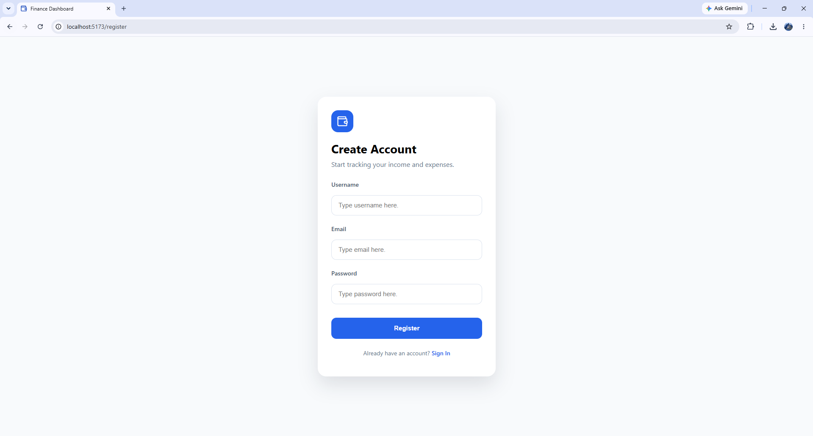
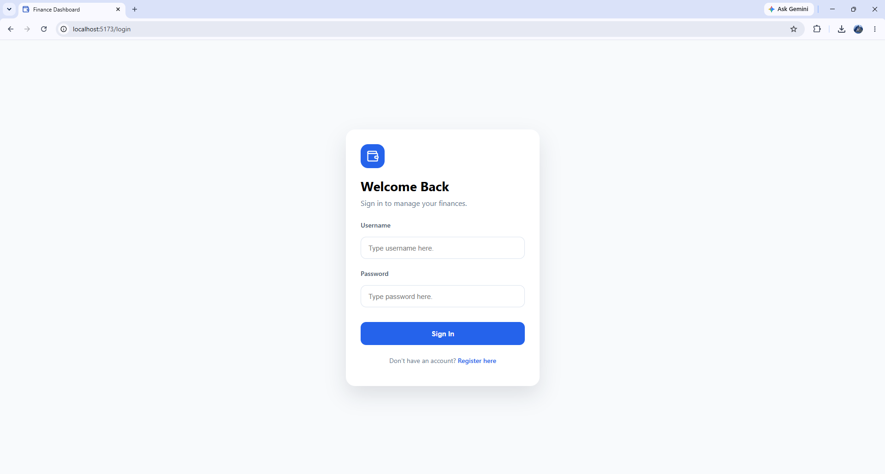
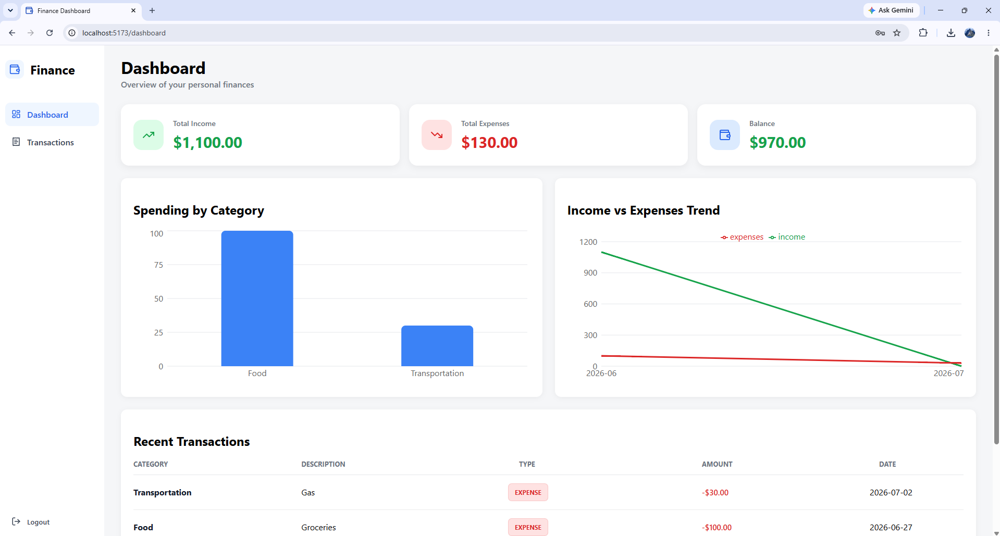
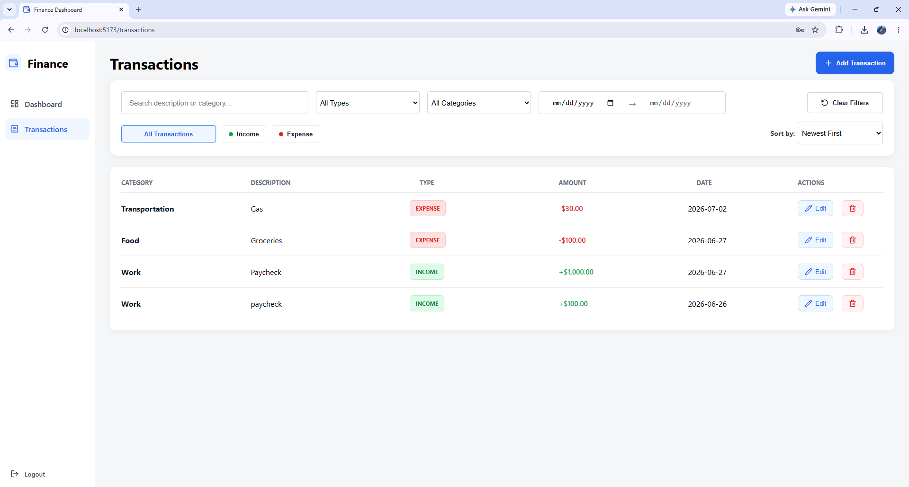

# Personal Finance Dashboard

A full-stack personal finance management application built with **Spring Boot** and **React**. Users can securely register, log in, and manage their personal finances through a modern dashboard with charts, filtering, and reporting.

---

## Features

### Authentication

- Secure user registration
- User login with JWT authentication
- BCrypt password hashing
- Protected frontend routes
- Public routes for authentication pages
- Automatic login after successful registration
- Custom 404 page
- Logout functionality

### Dashboard

- Financial summary cards
- Total Income
- Total Expenses
- Current Balance
- Monthly Income vs Expense chart
- Expense Category Breakdown chart
- Recent transactions

### Transactions

- Create transactions
- Edit transactions
- Delete transactions
- Search transactions
- Filter by:
  - Date Range
  - Type
  - Category
- Sort transactions
- Responsive transaction table

### Security

- Spring Security
- JWT Authentication
- Stateless Sessions
- Password Encryption (BCrypt)
- User-specific transaction access
- Global exception handling

---

# Tech Stack

## Backend

- Java 17
- Spring Boot
- Spring Security
- Spring Data JPA
- Hibernate
- MySQL
- JWT
- Maven

## Frontend

- React
- React Router
- Recharts
- Lucide React
- CSS

## Deployment

- Railway (Backend)
- Vercel (Frontend)

---

# Project Structure

```
personal-finance-dashboard
│
├── src
│   ├── auth
│   ├── security
│   ├── transaction
│   ├── summary
│   ├── user
│   └── ...
│
├── frontend
│   ├── src
│   │   ├── Dashboard.jsx
│   │   ├── Transactions.jsx
│   │   ├── Login.jsx
│   │   ├── Register.jsx
│   │   ├── ProtectedRoute.jsx
│   │   ├── PublicRoute.jsx
│   │   └── ...
│   └── ...
│
└── pom.xml
```

---

# Running Locally

## Backend

From the project root:

```bash
./mvnw spring-boot:run
```

Backend runs on:

```
http://localhost:8080
```

---

## Frontend

Open a second terminal.

Navigate to the frontend folder:

```bash
cd frontend
```

Install dependencies:

```bash
npm install
```

Start the development server:

```bash
npm run dev
```

Frontend runs on:

```
http://localhost:5173
```

---

# Environment Variables

## Backend

Configure the following environment variables before running the application:

```
DB_URL=
DB_USERNAME=
DB_PASSWORD=
JWT_SECRET=
```

## Frontend

```
VITE_API_URL=
```

---

# Authentication Flow

1. User registers or logs in.
2. Spring Security validates credentials.
3. Backend generates a signed JWT.
4. React stores the JWT.
5. Every protected request includes:

```http
Authorization: Bearer <token>
```

6. Protected routes verify authentication before rendering pages.

---

# Future Improvements

- Refresh Tokens
- Password Reset
- Email Verification
- User Profile
- Export Reports
- Dark Mode
- Multi-currency Support

---

# Screenshots

## Register



## Login



## Dashboard



## Transactions



---

# Technical Highlights

This project strengthened my understanding of:

- Full-stack application development
- Spring Boot architecture
- REST API design
- JWT authentication
- Spring Security
- React state management
- React Router
- Protected routes
- Responsive frontend development
- MySQL database design
- Secure authentication practices
- Git version control
- Deploying applications with Railway and Vercel

---

# Author

**Ethan Duenas**

Bachelor of Science in Computer Science
