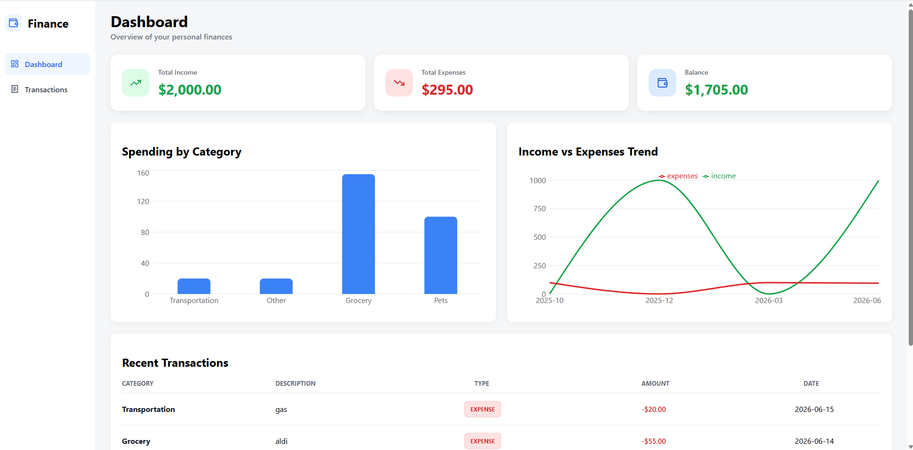
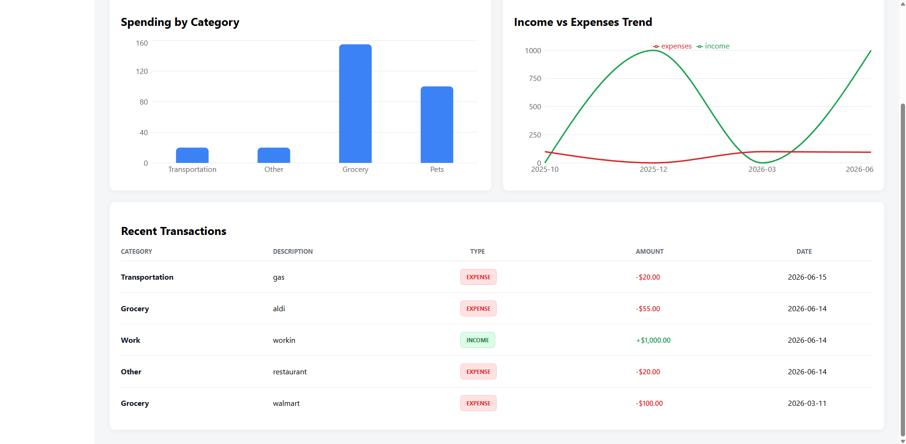
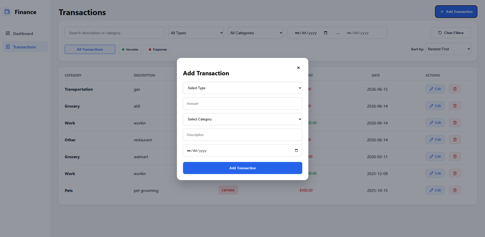

# Personal Finance Dashboard

A full-stack personal finance dashboard built with Spring Boot, React, and MySQL. The app allows users to track income and expenses, manage transactions, filter and search records, and view financial summaries through charts.

## Features

- Add, edit, and delete transactions
- Search transactions by category or description
- Filter by type, category, and date range
- Sort by date or amount
- Dashboard summary cards for income, expenses, and balance
- Spending by category chart
- Income vs expenses trend chart
- Recent transactions overview
- Responsive-style modern UI with modals and confirmation dialogs

## Tech Stack

### Backend

- Java
- Spring Boot
- Spring Data JPA
- MySQL
- Hibernate Validator

### Frontend

- React
- Vite
- React Router
- Recharts
- Lucide React
- CSS Grid/Flexbox

## Screenshots

## Backend API Endpoints

### Transactions

- `GET /transactions`
- `GET /transactions/{id}`
- `POST /transactions`
- `PUT /transactions/{id}`
- `DELETE /transactions/{id}`
- `GET /transactions/recent`

### Summary

- `GET /summary`
- `GET /summary/category`
- `GET /summary/monthly-trend`

## What I Learned

- Building REST APIs with Spring Boot
- Using Spring Data JPA and Specifications for dynamic filtering
- Connecting React to a backend API
- Managing React state for forms, filters, modals, and tables
- Creating reusable UI patterns like modals and dashboard cards
- Displaying backend data with charts
- Designing and polishing a full-stack dashboard UI

## Future Improvements

- User authentication
- Budget goals
- Custom categories
- CSV export
- Dark mode
- Backend pagination
- Deployment
